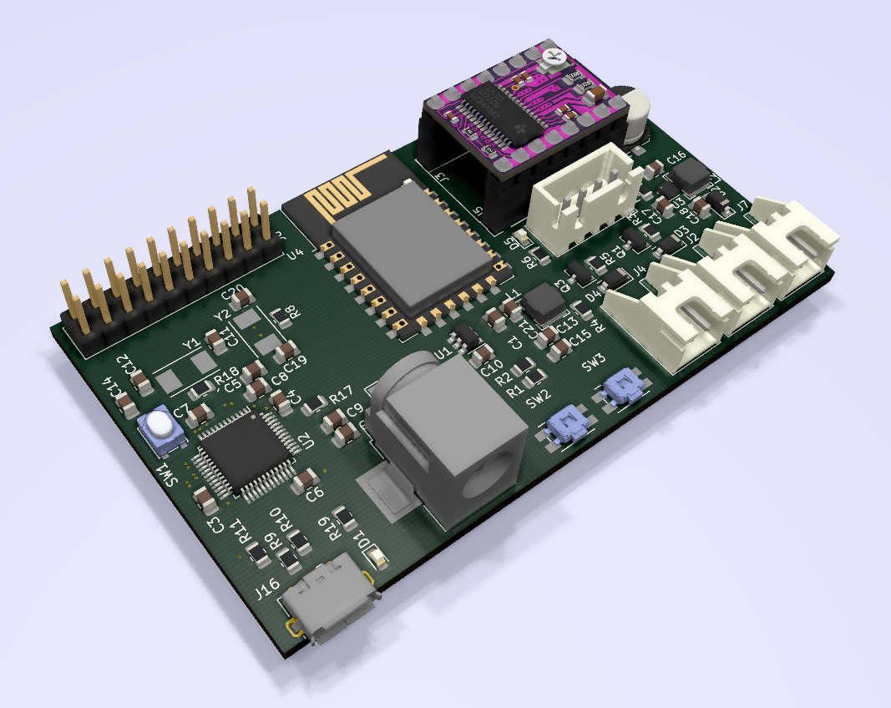
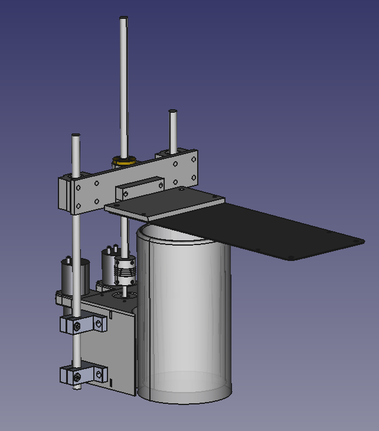

# The Robotanist 
The Robotanist is a fully integrated hydroponic rig. It allows users to hack on
using a raspberry pi. It gives the user control over...
    - Two pumps and their speeds
    - The Grow lights intensity
    - Height of the light, controlled with a stepper

# Electronics

Please find the electronics files in the ee folder, all pcb design is done with
the open source software KiCad. Is uses an STM32 as the main controller, and an
ST L6470 moter driver for the stepper motor. There are various connectors for
the subsystem components.  

## TODO
- Finish Make the PCB

# Firmware
Please find the firmware files in the fw folder. There is an STM32 running
FreeRTOS while using the libopencm3 HAL. The firmware has two main modes, 
`command mode` and `autonomous mode`.

## Command mode
Command mode is designed to be run while connected to a master device, such as
a Raspberry Pi. This may be used when you wish for the PI to make all the
decisions, such as control the height of the LED using machine vision.

## Autonomous Mode
Autonomous Mode is designed to be run stand alone, the device requires only
power to function. The STM must be pre programmed with a set recipe and is
left for months.

## TODO
- Autonomous mode

# Mechanical

Please find the mechanical in the mech subfolder. All of the mechanical design
is done us the open source software package FreeCAD (0.19). The design can be 3D
printed.

## Source
Sourcing components for the build can be found in the supply folder.

# General Notes
- Steriovision

- https://www.uctronics.com/camera-modules/camera-multiplexer/arducam-multi-camera-adapter-module-v2-2-for-raspberry-pi-4-3b-3b-5mp-and-8mp-cameras-compatible-with-arducam-mipi-cameras.html

- https://stereopi.com/
